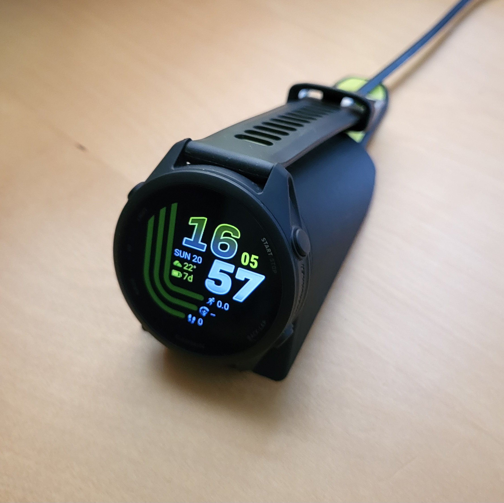
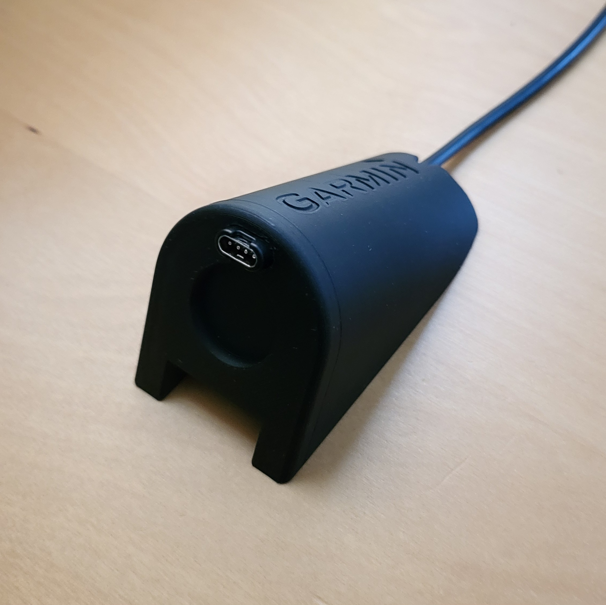
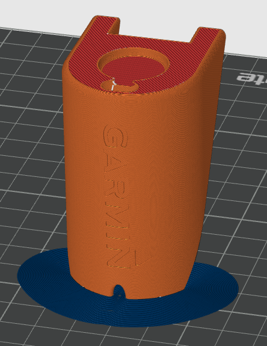
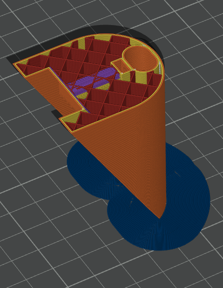

# Garmin Forerunner 170 Stand

Simple desk charging stand for the Garmin Forerunner 170.

  
  

## Hardware Required 
- 1x M3 x 6mm bolt (to secure the charging cable in place)
- 1x M3 nut 

## Print Settings
- **Layer height:** 0.08 mm
- **Walls:** 2
- **Infill:** 25%
- **Material:** PLA / PETG
- **Supports:** Brim (first layer)

- Add a **pause in print at 58 mm** (when using the orientation shown below) to drop the M3 nut into the internal slot before it gets bridged over.

  
  

## Files in models/
- `.stl`
- `.3mf`
- `.step` 

## License

Licensed under [CC BY-NC 4.0](https://creativecommons.org/licenses/by-nc/4.0/).
